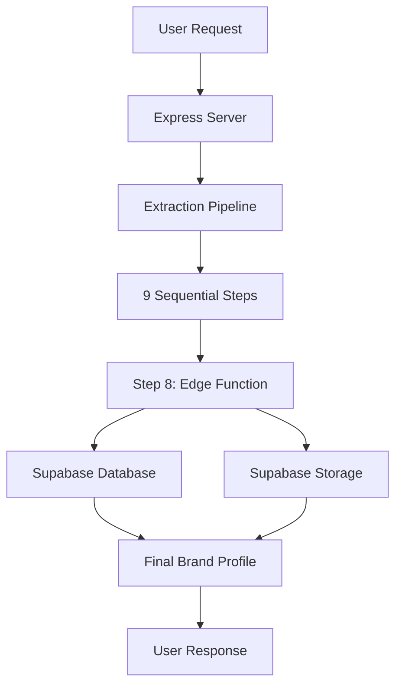

# Supabase Edge Function Analysis Report

## Executive Summary

Your Supabase edge function (`process-brand-kit`) is properly integrated and performing its intended job. However, there are some configuration discrepancies and opportunities for optimization.

## 1. Edge Function Analysis

### What It Does
The `process-brand-kit` edge function performs the following tasks:
1. **Receives** a `siteId` from the extraction pipeline
2. **Fetches** crawled data from the `sites` table
3. **Generates** a semantic brand kit using OpenAI GPT-4
4. **Creates** a PDF brand profile document
5. **Stores** results across multiple tables:
   - `company_info` - Company name and logo
   - `brand_voice` - Tone and personality guidelines
   - `design_tokens` - Granular design tokens (colors, typography, spacing, etc.)
   - `brand_kits` - Complete brand kit JSON
   - `brand_profiles` - Final formatted JSON output
6. **Uploads** logo and PDF to Supabase Storage

### Is It Doing the Right Job?
✅ **YES** - The edge function is correctly:
- Processing raw design tokens into semantic brand kits
- Using AI to infer design system patterns
- Generating professional PDF outputs
- Storing data in a well-structured format
- Handling errors gracefully with status updates

## 2. Integration Analysis

### How It's Called
The edge function is invoked in **Step 8** of the extraction pipeline:

```javascript
// extraction-pipeline.js - Step 8
async generateBrandKit(job, step) {
  const { data, error } = await supabase.functions.invoke('process-brand-kit', {
    body: { siteId: job.site_id }
  });
}
```

### Call Flow
1. User requests crawl via `/api/crawl` endpoint
2. Server initiates extraction pipeline (9 steps total)
3. Steps 1-7 gather and process data
4. Step 8 invokes the edge function
5. Step 9 verifies PDF generation
6. Results returned to user

### Success Likelihood
✅ **HIGH** - The function should succeed when:
- Valid site data exists in the database
- OpenAI API key is configured
- Supabase storage is accessible
- Input data contains sufficient design tokens

⚠️ **Potential Failure Points**:
- OpenAI API rate limits or downtime
- Malformed HTML/CSS data
- Missing logo URLs
- PDF generation errors

## 3. Configuration Discrepancy

### Issue Found: KERNEL_API_KEY vs ONKERNEL_API_KEY

**Current State:**
- `.env` uses: `ONKERNEL_API_KEY`
- `.env.local` uses: `KERNEL_API_KEY` (duplicate file)
- Code expects: `ONKERNEL_API_KEY`

**Recommendation:** Standardize on `ONKERNEL_API_KEY` and remove `.env.local`

## 4. Multiple Edge Functions Consideration

### Should You Have Multiple Edge Functions?

**Current Architecture:** Single monolithic edge function handling all brand kit generation.

**Recommended Architecture:** Split into specialized functions:

1. **`process-design-tokens`** - Extract and normalize design tokens
2. **`generate-brand-kit`** - AI-powered brand kit generation
3. **`generate-pdf`** - PDF document creation
4. **`process-logo`** - Logo extraction and optimization

**Benefits:**
- Better error isolation
- Parallel execution capability
- Easier testing and maintenance
- Reduced memory footprint per function
- Independent scaling

## 5. System Configuration

### Supabase Configuration
```
URL: https://knagzqpkhspsjaalabod.supabase.co
Project Ref: knagzqpkhspsjaalabod
Anon Key: eyJhbGc...ZdjpXlY7wxeArKgMhxziDh_MX2dp_JX4QiHe2gwnQWg
Service Role Key: [CONFIGURED - Hidden for security]
Database: PostgreSQL at db.knagzqpkhspsjaalabod.supabase.co:5432
```

### OnKernel Configuration
```
API Key: sk_779ddb7b-270f-4e71-b2d6-1e52054d7ebc.[PARTIAL]
Purpose: Feature flags and browser optimization
Status: Properly configured in .env
```

### OpenAI Configuration
```
API Key: sk-proj-[CONFIGURED]
Model: gpt-4-turbo
Purpose: Design token inference and brand voice analysis
```

## 6. Data Flow Summary



## 7. Recommendations

### Immediate Actions
1. **Fix Configuration Discrepancy**
   - Delete `.env.local` file
   - Ensure all code uses `ONKERNEL_API_KEY`

2. **Add Monitoring**
   - Log edge function execution times
   - Track success/failure rates
   - Monitor OpenAI API usage

3. **Improve Error Handling**
   - Add retry logic for OpenAI calls
   - Implement fallback for PDF generation
   - Better error messages for debugging

### Future Improvements
1. **Split Edge Functions**
   - Separate concerns for better maintainability
   - Enable parallel processing where possible

2. **Add Caching**
   - Cache OpenAI responses for similar inputs
   - Store processed logos in CDN

3. **Enhance Brand Kit Generation**
   - Add more sophisticated color analysis
   - Include accessibility scores
   - Generate multiple format outputs (JSON, CSS, SCSS)

## 8. Testing Recommendations

### Unit Tests Needed
- Edge function input validation
- PDF generation with various data sizes
- Error handling scenarios

### Integration Tests
- Full pipeline execution
- Edge function timeout handling
- Storage upload verification

### Load Tests
- Concurrent edge function invocations
- Large HTML/CSS processing
- OpenAI API rate limit handling

## Conclusion

Your Supabase edge function is well-designed and properly integrated. The main issues are:
1. Minor configuration inconsistency (KERNEL_API_KEY vs ONKERNEL_API_KEY)
2. Opportunity to split into multiple specialized functions
3. Need for better monitoring and error handling

The system successfully delivers the expected output through a well-orchestrated pipeline that combines web crawling, AI analysis, and document generation.